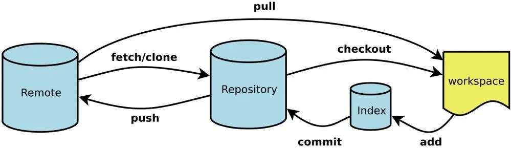
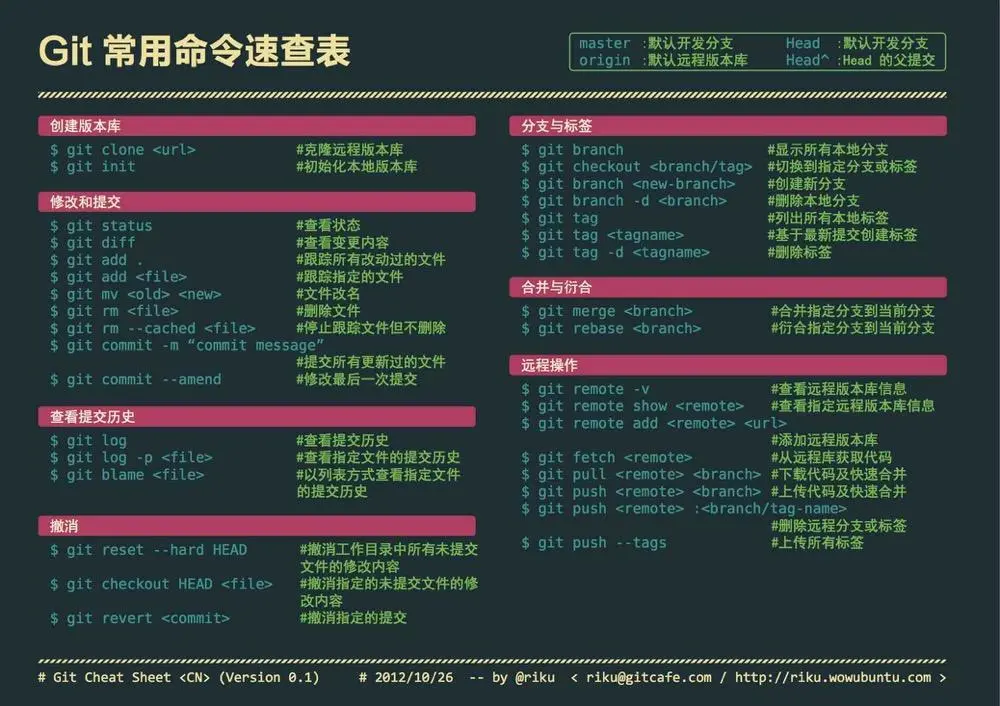

# 提交代码

1. `git status`：查看当前状态
2. `git add .`：添加到本地缓冲区
3. `git commit -m ‘注释’`：提交至本地仓库
4. `git pull origin master`：拉取远程的更新
5. `git push origin master`：提交至远程仓库

# 更新代码

1. `git remote -v`：查看远程分支
2. `git fetch origin master:temp`：获取远程最新版本至本地temp分支中
3. `git diff temp`：比较本地仓库与temp分支的区别
4. `git merge temp`：合并temp分支至本地仓库
5. `git branch -d temp`：删除本地temp分支

# 覆盖代码

1. `git fetch --all`：拉取远程仓库所有更新
2. `git reset --hard origin/master`：覆盖本地仓库同名内容
3. `git pull origin master`：拉取远程的更新

# 查看日志

1. `git log`：查看所有日志
2. `git log -n`：查看最近n条日志
3. `git shortlog`：查看提交过的用户及次数注释
4. `git shortlog -sn`：查看提交过的用户次数并排序

# 远程地址

1. `git remote -v`：查看远程仓库名称
2. `git remote get-url origin`：获取关联的远程仓库地址
3. `git remote set-url origin https://.../xxx.git `：设置关联的远程仓库地址
4. `git remote rm origin`：删除本地仓库关联的远程仓库
5. `git remote add origin https://.../xxx.git`：添加新的远程仓库地址

# 配置账户

1. `git config user.name`：查看用户名
2. `git config user.email`：查看邮箱
3. `git config --global user.name ‘xxx’`：设置全局用户名
4. `git config --global user.email ‘xxx@qq.com’`：设置全局邮箱

---

