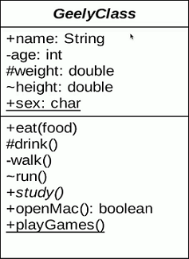
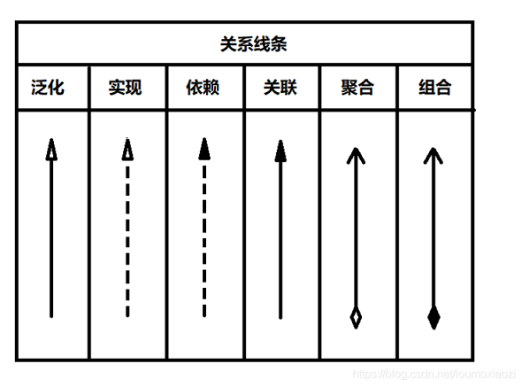
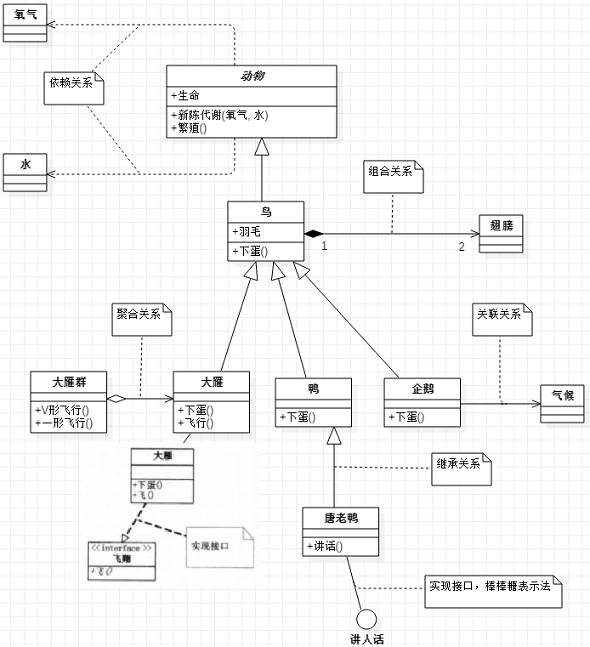

## 类图基础属性

符号含义：+表示public    -表示private    #表示protected   ~表示default   _表示static   斜体表示抽象。

## 类与类之间的关系

在UML类图中，常见的有以下几种关系: 

1. 泛化（继承）：表示类与类之间的继承关系，接口与接口之间的继承关系，或类对接口的实现关系。
2. 实现：表示一个类实现接口（可以是多个）的功能。
3. 依赖：对于两个相对独立的对象，当一个对象负责构造另一个对象的实例，或者依赖另一个对象的服务时，这两个对象之间主要体现为依赖关系。
4. 关联：对于两个相对独立的对象，当一个对象的实例与另一个对象的一些特定实例存在固定的对应关系时，这两个对象之间为关联关系。
5. 聚合：表示一种弱的‘拥有’关系，即has-a的关系，体现的是A对象可以包含B对象，但B对象不是A对象的一部分。 两个对象具有各自的生命周期。
6. 组合：表示一种强的‘拥有’关系，是一种contains-a的关系，体现了严格的部分和整体关系，部分和整体的生命周期一样。

